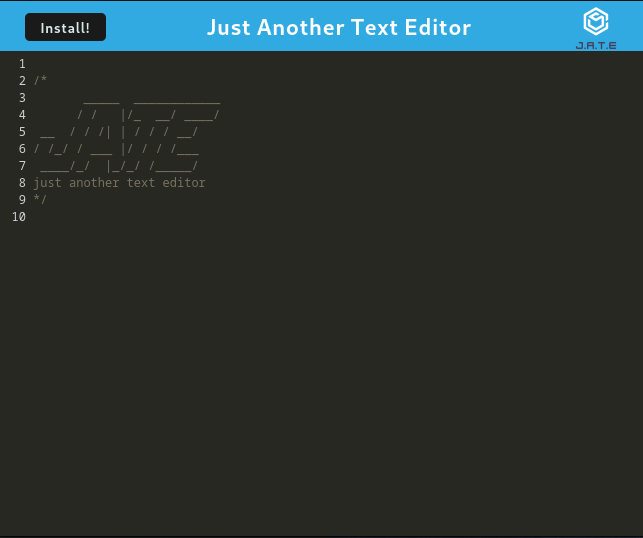

# Text-Editor-PWA

## Description

This project is a text editor that runs in the browser. The app is a single-page application that meets the PWA criteria. It features a number of data persistence techniques that serve as redundancy in case one of the options is not supported by the browser. The application will also function offline.

## Table of Contents 

- [Installation](#installation)
- [Usage](#usage)
- [Credits](#credits)
- [License](#license)

## Installation

* Once app is deployed, click the install button in the upper left-hand corner

## Usage

---

### Live DEMO

[DEMO](https://immense-ravine-64143.herokuapp.com/)

## Credits

* Heroku
* Node
* webpack

## License

 

## Badges

  

